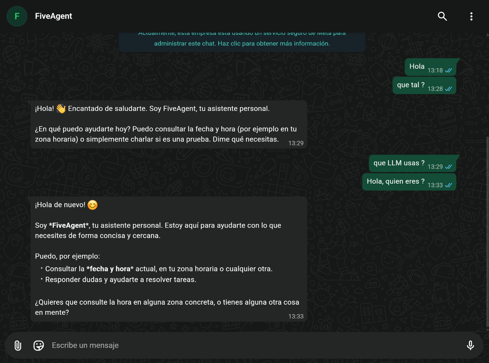
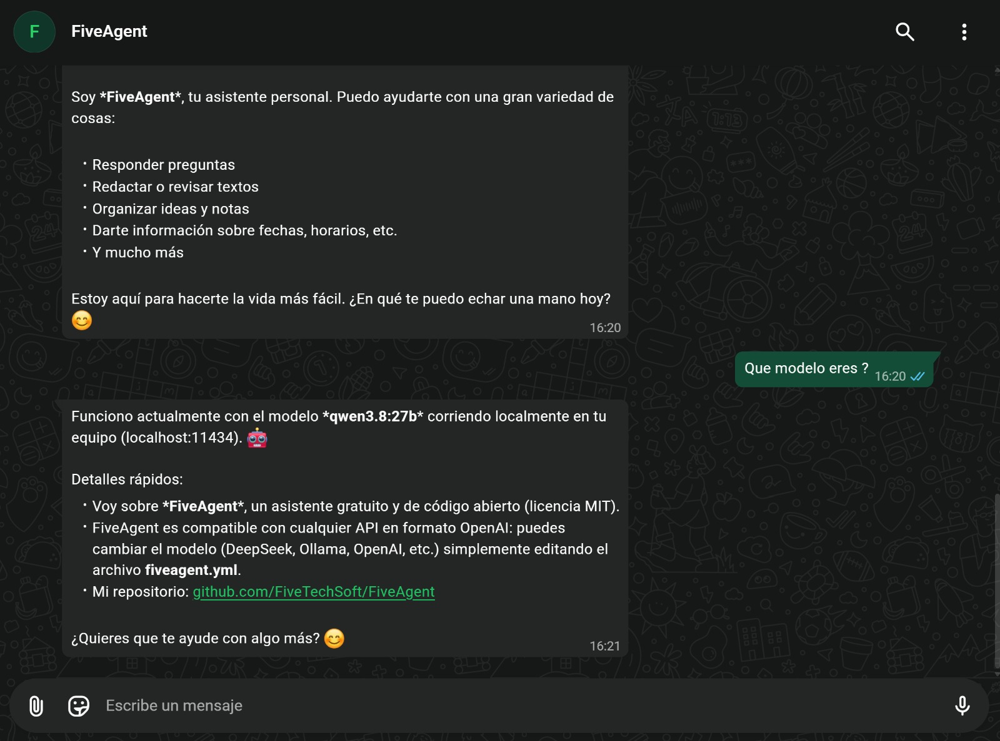

# FiveAgent

Your personal AI agent. Open source, self-hosted, model-agnostic.

FiveAgent wants to be a personal assistant that lives in your messaging apps and works for you. It runs on your own hardware with Docker, talks to the model **you** choose (local or commercial), and keeps your data in your own database. It's brand new: what works today and what's still missing is written below, plainly.

## Why FiveAgent

- **Self-host for real.** One `docker compose up`. Postgres and the agent on your machine. No mandatory cloud accounts, no vendor lock-in.
- **Model freedom.** Any OpenAI-compatible endpoint: local models via Ollama / llama.cpp / vLLM, or commercial APIs (OpenAI, DeepSeek, Anthropic via adapter). Change model by editing one config line.
- **Chat-first.** WhatsApp (official Cloud API) and Telegram work today; iMessage is on the roadmap. You talk to it where you already talk.
- **Your data stays yours.** Memory in your own Postgres. Data only leaves your machine where you decide: to the model you configured and to the messaging platforms you connect (e.g. Meta's servers when you use the official WhatsApp API).
- **Open by design.** MIT license, semantic releases, public roadmap. Community PRs welcome and actually reviewed.

## Where FiveAgent runs

On a machine you control - your Windows PC or your own server, never on
someone else's cloud. Three things live there:

- `fiveagent` (`fiveagent.exe` on Windows): the agent itself, listening
  on `localhost:8080`.
- `cloudflared`: the only piece that faces the internet. It runs next
  to the agent on the same machine and forwards Meta's webhooks to
  `localhost:8080`. On Windows, install the MSI, then
  `cloudflared service install <tunnel-token>` so it starts with the PC.
- Ollama (optional, for local models): same machine,
  `localhost:11434`. It has no auth: never expose it publicly, keep it
  on localhost.

Moving to another machine one day? Install FiveAgent and cloudflared
there and start the tunnel with the same token: the public URL and the
Meta webhook stay the same, because they live at Cloudflare, not on
your box.

## Quick start

FiveAgent needs just two things: somewhere to run (Docker or Go) and a model to talk to (one you run yourself, like Ollama, or a paid API like OpenAI or DeepSeek).

### Step 1. Install what you need

Pick ONE:
- **Docker Desktop** (recommended, easiest): https://www.docker.com/products/docker-desktop - runs everything for you: the agent, its database and its browser.
- **Go** (if you prefer a single program file): https://go.dev/dl - version 1.24 or newer.

If you want a free local model, also install **Ollama**: https://ollama.com - then run `ollama pull llama3.1` once.

### Step 2. Download FiveAgent

```bash
git clone https://github.com/FiveTechSoft/FiveAgent
cd FiveAgent
```

No git? On the repo page click the green **Code** button and then **Download ZIP**, and unzip it.

### Step 3. Create your settings file

Make your own copy of the example settings:

```bash
# Windows (type this in cmd or PowerShell)
copy fiveagent.yml.example fiveagent.yml

# Mac / Linux
cp fiveagent.yml.example fiveagent.yml
```

Open `fiveagent.yml` with any text editor (Notepad works). The only part you must touch is `model`:

```yaml
model:
  base_url: http://localhost:11434/v1   # where the model lives
  name: llama3.1                        # which model to use
  api_key: ""                           # empty for Ollama; your key for OpenAI/DeepSeek
```

- Using Ollama? Leave it as shown above.
- Using OpenAI? Set `base_url: https://api.openai.com/v1`, `name: gpt-4o-mini` and paste your API key.
- Using DeepSeek? Set `base_url: https://api.deepseek.com/v1`, `name: deepseek-chat` and paste your API key.

### Step 4. Start it

With Docker:

```bash
docker compose up --build
```

Or with Go:

```bash
go build -o fiveagent ./app/fiveagent
./fiveagent
```

### Step 5. Talk to it

WhatsApp: follow [docs/whatsapp.md](docs/whatsapp.md) - guía en español, paso a paso, con las trampas reales ya documentadas.



 Telegram: [docs/telegram.md](docs/telegram.md), five minutes with @BotFather, no tunnel needed. iMessage is coming next.

Something doesn't work? Open an issue: https://github.com/FiveTechSoft/FiveAgent/issues - tell us your operating system and the exact error message.

## Architecture

One service, three layers. See [docs/design.md](docs/design.md) for the full design.

- **Channels** - thin adapters that normalize messages into one event format. WhatsApp and Telegram are implemented; iMessage is planned.
- **Core** - a single Go binary running the agent loop: conversation memory and model calls. Provider-agnostic.
- **Tools** - planned: web search, email, calendar, files, and a sandboxed browser (Playwright sidecar container, already in docker compose).

## Works today

- Single Go binary, no runtime. Docker compose brings up the agent, Postgres and a Playwright sidecar.
- WhatsApp channel via the official Cloud API, verified end-to-end in a live install ([guía en español paso a paso](docs/whatsapp.md)). Telegram channel via long polling (no public URL needed).
- Conversation memory in Postgres: the agent remembers the last 20 messages of each chat.
- Any OpenAI-compatible model by config: Ollama, llama.cpp, vLLM, OpenAI, DeepSeek.
- Tool calling: the model can call tools (OpenAI-style function calling). Built-in tools: current date/time and `run_command`, which executes commands inside a per-user sandbox (bubblewrap backend on Linux, tested: no network, only the user's folder writable; Docker and Windows Job Objects backends included, pending live verification).

## Roadmap

Tracked as GitHub issues and milestones, in this order:

1. ~~Tool calling in the agent loop~~ (done)
2. ~~Telegram channel~~ (done)
3. Per-user sandboxed command execution (bubblewrap on Linux works and is tested; Windows AppContainer + Job Objects backend compiles, pending live verification on a real PC; Docker fallback included, pending live test; macOS sandbox-exec later)
4. CI with tests (GitHub Actions)
5. First release: v0.0.1
6. Long-term memory (pgvector), secrets encrypted at rest, prompt-injection tests
7. Tools: web search, browser, email, calendar
8. iMessage channel

Details in [docs/ROADMAP.md](docs/ROADMAP.md).

## Security

- Today: your secrets live in `fiveagent.yml` / environment variables on your machine. Keep that file private (it's in .gitignore).
- The browser sidecar runs in its own container.
- On the roadmap: secrets encrypted at rest (AES-256-GCM) and a prompt-injection test suite in CI. External content will be treated as data, never as instructions.

## Status

Early days. Not ready for production use. Star the repo and watch the releases.

## Contributing

Issues and PRs welcome. See [CONTRIBUTING.md](CONTRIBUTING.md).

## License

MIT - see [LICENSE](LICENSE).

Parts of the design are inspired by [OpenInstinct](https://github.com/Merit-Systems/OpenInstinct) (MIT, Merit Systems). Attribution in [NOTICE](NOTICE).
