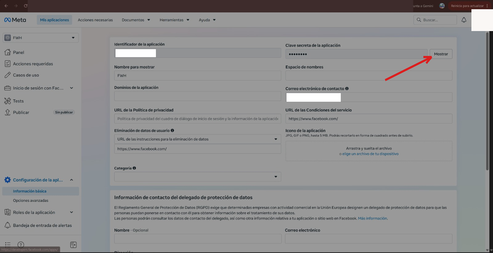

# Conectar WhatsApp, paso a paso

Esta guía te lleva de cero a hablar con FiveAgent por WhatsApp en unos
15 minutos. Todo es gratis. Está escrita desde una instalación real: cada
trampa descrita aquí nos pasó de verdad.

**English summary:** this is the WhatsApp setup guide (Meta Cloud API,
cloudflared tunnel, webhook registration). The steps below are in simple
Spanish; the Meta panel button names are quoted so you can follow them in
any language.

## Lo que necesitas

- Tu PC con FiveAgent funcionando (ver el README).
- **cloudflared**: da una dirección pública a tu PC. Sin cuenta.
- Una cuenta de Facebook para crear la **app de Meta** (gratis): de ahí
  salen el número de prueba y el token.

## Paso 1 - Crear la app de Meta y copiar 2 valores

1. Entra en https://developers.facebook.com e inicia sesión.
2. **Mis aplicaciones** → **Crear app** → **Otro** → **Empresa**, ponle
   el nombre que quieras.
3. En el menú de la izquierda: **Casos de uso** → busca **WhatsApp** →
   **Personalizar**.
4. Estás en **Configuración de la API**. Apunta:
   - **Token de acceso temporal**
   - **Identificador del número de teléfono** (phone number id), bajo "De"
   - El **número de prueba** que aparece ahí (a ese número escribirás)

> Ojo: el token temporal **caduca en 24 horas**. Cuando caduque, vuelve a
> esta página y pega el nuevo en fiveagent.yml. (Existe un token
> permanente con un "usuario del sistema" en Meta Business; no hace falta
> para empezar.)

> Captura real pendiente de publicar.

## Paso 2 - Añadir tu número como destinatario de prueba

Mientras la app está en modo prueba, Meta **solo** entrega mensajes a los
números que autorices:

1. En la misma **Configuración de la API**, sección **Para** →
   **Administrar lista de números**.
2. Añade tu número con prefijo de país (ej.: +34 600 123 456).
3. Meta te manda un código por WhatsApp; introdúcelo para confirmar.

> Captura real pendiente de publicar.

## Paso 3 - Rellenar fiveagent.yml y arrancar

```yaml
channels:
  whatsapp:
    enabled: true
    access_token: "<token temporal del Paso 1>"
    phone_number_id: "<identificador del número del Paso 1>"
    verify_token: "<una palabra inventada por ti, larga y rara>"
```

Arranca FiveAgent (`fiveagent.exe` o `docker compose up`). Debe decir
`whatsapp webhook listening on :8080/webhook/whatsapp`.

## Paso 4 - Dar una dirección pública a tu PC (cloudflared)

1. Descarga cloudflared:
   https://github.com/cloudflare/cloudflared/releases
   (Windows: `cloudflared-windows-amd64.msi`).
2. Ejecuta:

   ```
   cloudflared tunnel --url http://localhost:8080
   ```

3. El terminal muestra una URL tipo
   `https://palabras-al-azar.trycloudflare.com`. Cópiala.

> **Importante:** la URL **cambia cada vez que reinicias cloudflared**.
> Si lo reinicias, repite el Paso 5 con la URL nueva. Deja la ventana de
> cloudflared abierta mientras uses el bot.

## Paso 5 - Registrar el webhook (las DOS cosas, no una)

Aquí es donde casi todo el mundo se queda atascado. Hacen falta **dos
registros distintos**, y el panel de Meta te deja hacer el primero sin
avisarte de que falta el segundo. Nos pasó: el panel mostraba "eventos"
pero **no llegaba ningún mensaje**.

### 5a - El webhook de la app

1. **Casos de uso** → WhatsApp → **Personalizar** → **Configuración**
   (si ves "Información básica", estás en la página equivocada - abajo
   hay una captura).
2. Sección **Webhook** → **Editar**:
   - **URL de devolución de llamada**: tu URL de cloudflared **más**
     `/webhook/whatsapp`, por ejemplo
     `https://palabras-al-azar.trycloudflare.com/webhook/whatsapp`
   - **Token de verificación**: el mismo `verify_token` de fiveagent.yml
3. **Verificar y guardar**. Con FiveAgent y cloudflared encendidos,
   funciona a la primera.
4. **No cierres todavía:** en **Campos de webhook** (aparece en el
   "Paso 2. Configuración de producción" del asistente) **suscríbete a
   `messages`**. Sin esto, Meta muestra eventos en el panel pero **nunca
   envía nada a tu PC**. Esta fue nuestra primera trampa real.

> Captura real pendiente de publicar.

### 5b - Suscribir la app a la cuenta de WhatsApp Business

Aunque el webhook esté registrado, los mensajes reales **no llegan** si la
app no está suscrita a la WhatsApp Business Account (WABA). Síntoma real:
en `subscribed_apps` solo aparece "WA DevX Webhook Events 1P App" (la app
interna de Meta), no la tuya. Esta fue nuestra segunda trampa real.

El panel no deja hacer esto; va por API. Necesitas tu **WABA id**: está en
**Configuración de la API**, o en la URL cuando navegas por WhatsApp en
el panel. Con el token del Paso 1:

```
curl -X POST "https://graph.facebook.com/v21.0/<WABA_ID>/subscribed_apps" \
  -H "Authorization: Bearer <TOKEN>"
```

Debe responder `{"success": true}`. Compruébalo con un GET al mismo URL:
tu app tiene que aparecer en la lista.

## Paso 6 - Probar

Desde tu WhatsApp (el número que autorizaste en el Paso 2), escribe
**Hola** al número de prueba. FiveAgent responde.

En el registro de FiveAgent verás líneas como:

```
whatsapp: inbound POST, 439 bytes
whatsapp: message from 34600123456 (type text)
```

Si no aparece **nada**, Meta no está entregando: repasa 5a (¿`messages`
suscrito?) y 5b (¿tu app en `subscribed_apps`?). Son las dos trampas que
nos costaron horas.

## Si reinicias algo

- **cloudflared** → URL nueva → repite el Paso 5a con la URL nueva.
- **Token de 24 h caducado** → token nuevo del Paso 1 en fiveagent.yml y
  reinicia FiveAgent.

## ¿Y en el futuro?

Queremos un `fiveagent setup whatsapp` que haga todo esto con un comando
([issue #14](https://github.com/FiveTechSoft/FiveAgent/issues/14)).
**Todavía no existe**: hoy el camino es esta guía.

## Página equivocada frecuente

Si al entrar ves "Información básica" con un "Identificador de la
aplicación" y una "Clave secreta", **no es ahí** (y no toques la clave
secreta). Ve a **Casos de uso** → WhatsApp → **Personalizar**:



---

## Referencia técnica

### Lo que funciona hoy

- Verificación del webhook (`GET`) con comparación en tiempo constante.
- Entrante: texto, imágenes, notas de voz, documentos, vídeo, stickers,
  ubicaciones y reacciones, descritos al agente (ej.: `[image: caption]`).
  `DownloadMedia` baja los bytes de Meta cuando haga falta.
- Saliente: texto, media por enlace (`SendMedia`), plantillas aprobadas
  para fuera de la ventana de 24 h (`SendTemplate`), subida de media
  (`UploadMedia`).
- Acuse de lectura + indicador de "escribiendo..." al recibir.
- Las respuestas citan el mensaje original.
- Estados de entrega (enviado/entregado/leído/fallido) en el registro.
- Verificación opcional de firma X-Hub-Signature-256 con `app_secret`.
- Procesado asíncrono (200 rápido; Meta reintenta si no).
- Registro de cada POST entrante y cada mensaje.
- Tests: `go test ./internal/channel/`.

### Probado en vivo

Circuito completo verificado de punta a punta (27-sep-2026): un "Hola"
real desde un teléfono entró por el webhook, el agente respondió con
DeepSeek y la respuesta llegó al teléfono. Registro real:

```
whatsapp: inbound POST, 555 bytes
whatsapp: message from 346XXXXXXXXX (type text)
```

y la respuesta entregada en WhatsApp segundos después:

 Las trampas 5a y
5b de arriba son exactamente las que encontramos en esa instalación.

### Lo que falta hoy

- Transcribir notas de voz (necesita un servicio de voz a texto).
- Capturas reales de los pasos 1, 2, 4 y 5 (se publican solo capturas
  reales, nunca maquetas).
