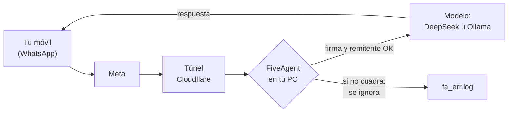
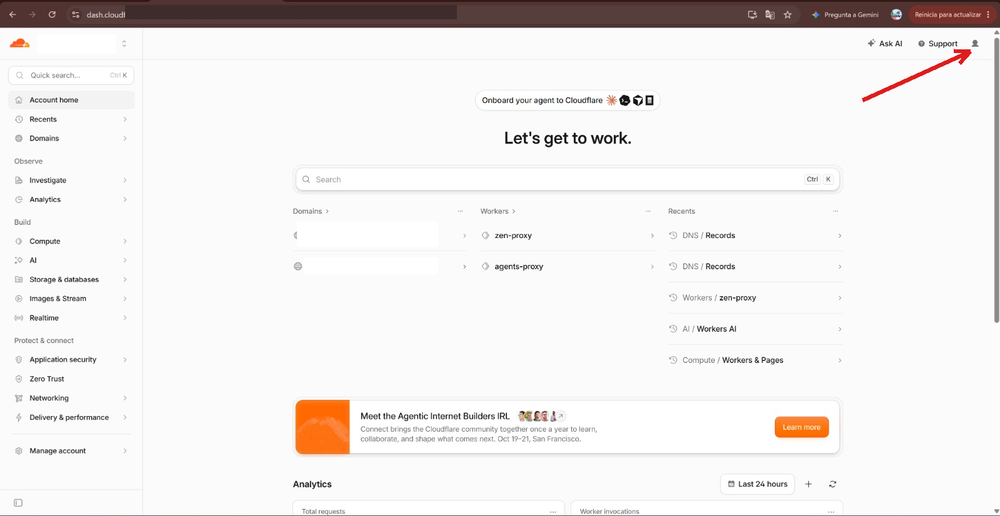
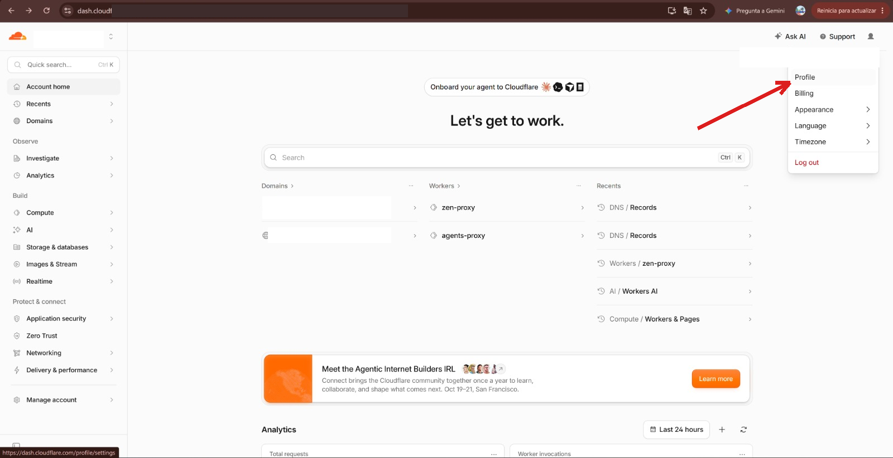
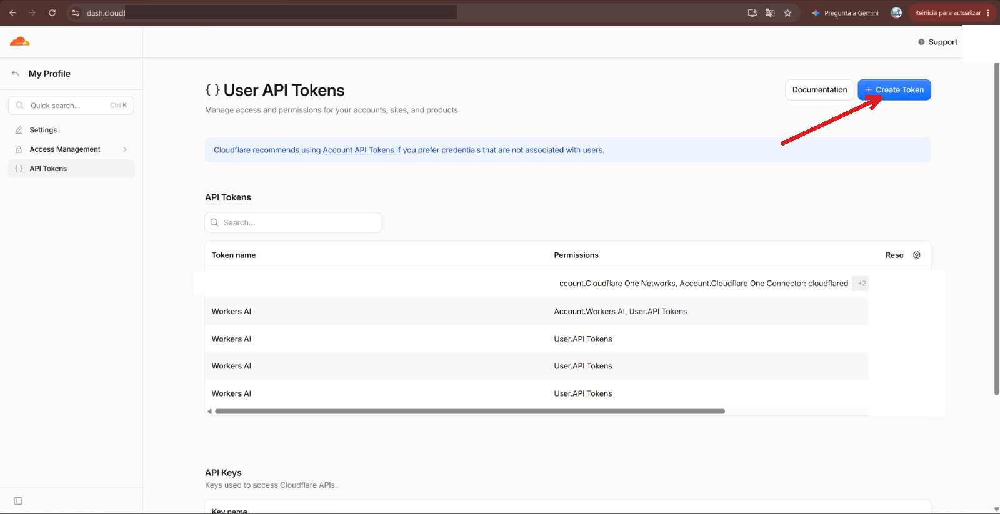
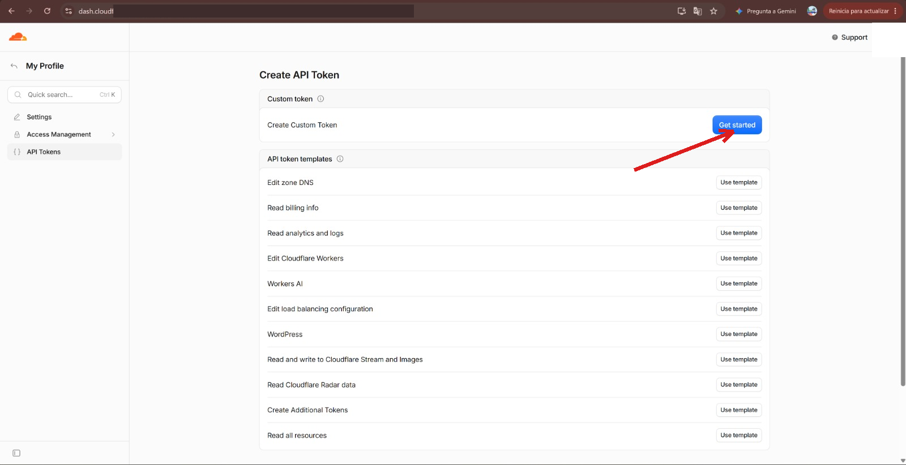
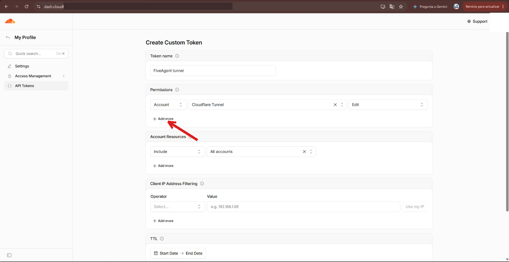
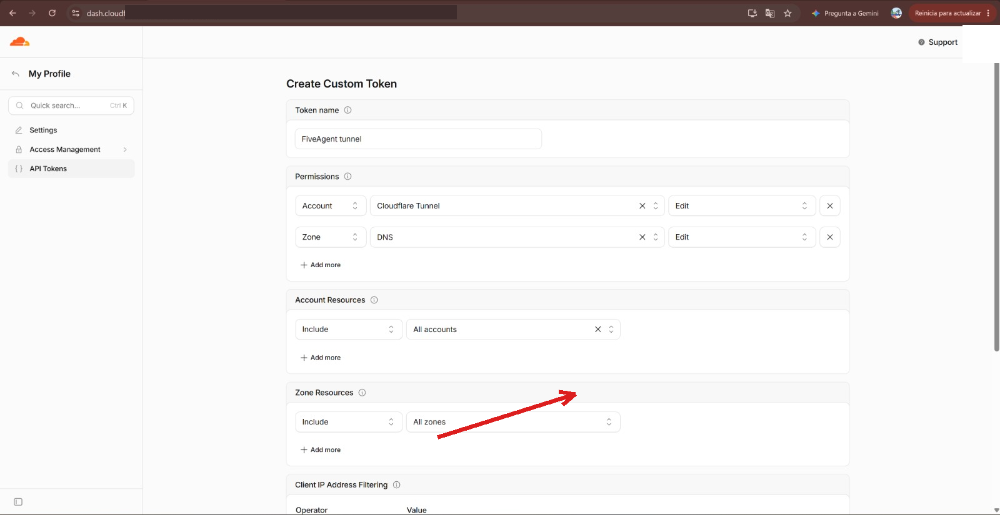
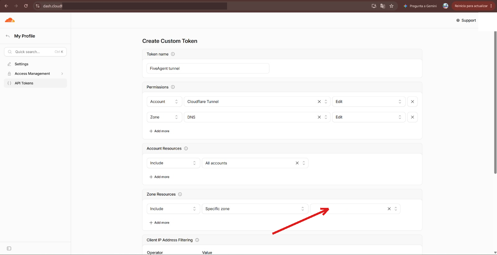
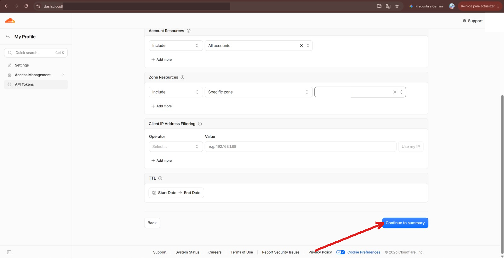
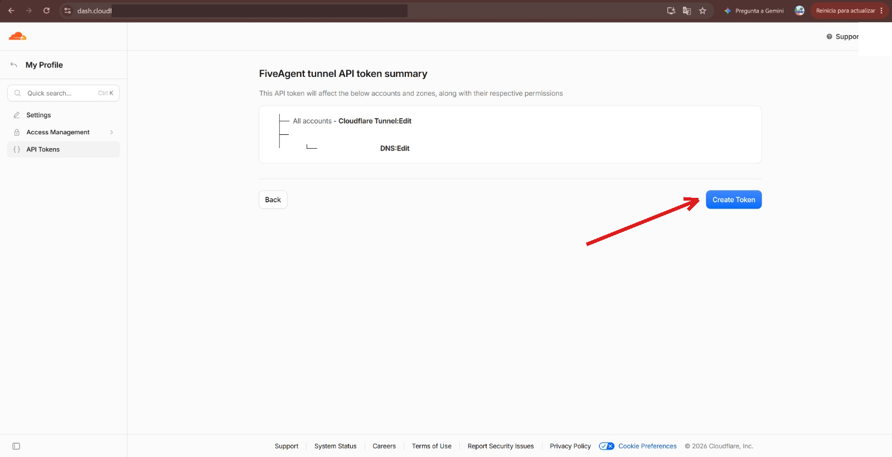

# WhatsApp con FiveAgent: guía para principiantes

Esta guía te lleva de cero a hablar con FiveAgent por WhatsApp. No hace
falta saber programar. Cada paso tiene **una sola acción**, su captura
real y un "qué deberías ver". Todas las capturas son reales (con los
datos privados tapados) y las trampas descritas nos pasaron de verdad en
una instalación real el 27-sep-2026.

**English:** beginner WhatsApp setup guide. The steps are in simple
Spanish; the Meta panel button names are quoted so you can follow them
in any language.

## Cómo funciona (el dibujo)



Tu móvil escribe al número de prueba. Meta avisa a tu PC a través del
túnel. FiveAgent comprueba que el aviso viene de Meta de verdad (firma)
y que el remitente tiene permiso, piensa la respuesta con el modelo y
la devuelve por el mismo camino.

Dos palabras que salen mucho:

- **token**: una contraseña larga que Meta te da para que tu programa
  pueda hablar con su API. Caduca en 24 horas (la versión para empezar).
- **webhook**: la dirección pública donde Meta entrega los mensajes que
  te escriben. Es la URL del túnel más `/webhook/whatsapp`.

## Lo que necesitas

- Un PC con Windows y conexión a internet.
- Una cuenta de Facebook (para crear la app de Meta, gratis).
- Tu móvil con WhatsApp.
- Unos 30 minutos.

---

# Parte 1: tu PC (el "server")

## Paso 1 - Descarga y compila FiveAgent

Instala Go (https://go.dev/dl/, el instalador para Windows, siguiente-
siguiente) y Git (https://git-scm.com/download/win). Abre PowerShell:

```
git clone https://github.com/FiveTechSoft/FiveAgent
cd FiveAgent
go build -o fiveagent.exe ./app
```

**Qué deberías ver:** un archivo `fiveagent.exe` en la carpeta. (De
momento se compila así; cuando haya descargas listas lo diremos aquí.)

## Paso 2 - Crea tu fiveagent.yml

Crea un archivo `fiveagent.yml` al lado de `fiveagent.exe` con este
contenido (de momento deja los valores de WhatsApp vacíos, los
rellenarás en el Paso 8):

El modelo es quien redacta las respuestas. Tienes dos opciones;
rellena **una** de las dos:

Opción A - **DeepSeek** (nube, es con la que hicimos la prueba en vivo
de esta guía; necesita una API key de https://platform.deepseek.com):

```yaml
model:
  provider: openai-compatible
  base_url: "https://api.deepseek.com/v1"
  api_key: "<tu clave de DeepSeek>"
  name: "deepseek-chat"

channels:
  whatsapp:
    enabled: true
    access_token: ""          # Paso 8
    phone_number_id: ""       # Paso 8
    verify_token: "inventa-una-palabra-larga-y-rara"
```

Opción B - **Ollama** (gratis, todo en tu PC, sin nube; todavía no lo
hemos probado en vivo - si lo pruebas, cuéntanos):

```yaml
model:
  provider: openai-compatible
  base_url: "http://localhost:11434/v1"
  api_key: ""                 # con Ollama va vacío
  name: "qwen3"               # el modelo que hayas descargado

channels:
  whatsapp:
    enabled: true
    access_token: ""          # Paso 8
    phone_number_id: ""       # Paso 8
    verify_token: "inventa-una-palabra-larga-y-rara"
```

Las dos opciones llevan la misma idea: el bot sabe qué modelo usa y, si se
lo preguntas ("¿qué modelo eres?"), te lo dice claro. Antes se inventaba la
respuesta; ahora el programa le dice al modelo su nombre y su dirección.

Si quieres cambiar su forma de hablar, añade al final del archivo una línea
`system_prompt` con tu propia descripción (opcional; en
`fiveagent.yml.example` tienes un ejemplo). La parte de "qué modelo soy" se
añade siempre sola.

Para Ollama: instálalo de https://ollama.com y descarga un modelo con
`ollama pull qwen3` (u otro). Déjalo corriendo; FiveAgent habla con él
en tu propio PC.

- `verify_token`: invéntatelo tú. Lo usarás dos veces: aquí y en el
  panel de Meta. Sirve para que Meta compruebe que habla contigo.

## Paso 3 - Arranca FiveAgent

```
.\fiveagent.exe
```

**Qué deberías ver:** una línea que dice que está escuchando, algo como
`whatsapp webhook listening on :8080/webhook/whatsapp`. Significa: "tu
PC espera mensajes de Meta en el puerto 8080". Deja esta ventana
abierta. Si algo falla, mira el archivo `fa_err.log` en la misma
carpeta: ahí se apuntan los errores y cada mensaje que llega.

---

# Parte 2: la app de Meta

## Paso 4 - Entra en tu app de Meta

Entra en https://developers.facebook.com/apps e inicia sesión. Si no
tienes app: **Crear aplicación** → **Otro** → **Empresa** y ponle el
nombre que quieras. Si ya tienes una, haz clic en ella:


**Qué deberías ver:** tu app en la lista, como en la captura.

## Paso 5 - Abre el caso de uso de WhatsApp

En el menú de la izquierda: **Casos de uso**. En la tarjeta de
WhatsApp, pulsa **Personalizar**:


**Qué deberías ver:** la pantalla "Personaliza el caso de uso".

## Paso 6 - Ve a "Paso 1. Probar"

En el menú de la izquierda, dentro de **Configuración básica**, pulsa
**Paso 1. Probar...**:


**Qué deberías ver:** la sección "Solicita un número de prueba de
WhatsApp".

## Paso 7 - Genera el número de prueba y apunta 3 cosas

Pulsa **Generar identificador**. Meta crea tu número de prueba y tu
primer token:


Apunta en un papel (o directamente en tu `fiveagent.yml`, Paso 8):

1. el **token de acceso** (la contraseña larga),
2. el **Phone Number ID**,
3. el **número de prueba** (a ese número escribirás desde tu móvil).

**Qué deberías ver:** los campos rellenos donde la captura tiene los
huecos en blanco (en la captura están tapados, son datos privados).

> Ojo: este token **caduca en 24 horas**. Si mañana el bot no envía,
> vuelve aquí, copia el token nuevo y ponlo en `fiveagent.yml`.

## Paso 8 - Rellena fiveagent.yml

Vuelve a tu `fiveagent.yml` y rellena:

- `access_token`: el token del Paso 7.
- `phone_number_id`: el Phone Number ID del Paso 7.

Reinicia FiveAgent (cierra la ventana y vuelve a ejecutar
`.\fiveagent.exe`).

**Qué deberías ver:** otra vez la línea de "listening". Sin errores en
`fa_err.log`.

## Paso 9 - Autoriza tu número de móvil

Mientras la app está en modo prueba, Meta **solo** entrega mensajes a
los números que autorices. En la misma página del Paso 7, baja a
**Destinatario** y pulsa **Administrar lista de números de teléfono**:


Añade tu número con prefijo de país (ejemplo: +34 600 123 456). Meta te
envía un código por WhatsApp; escríbelo para confirmar.

**Qué deberías ver:** tu número en la lista, confirmado.

---

# Parte 3: el túnel (una dirección pública para tu PC)

Tu PC está en tu casa y Meta no puede verlo. **cloudflared** crea un
túnel: una dirección pública temporal que lleva a tu PC.

## Paso 10 - Instala y arranca cloudflared

1. Descárgalo: https://github.com/cloudflare/cloudflared/releases
   (Windows: `cloudflared-windows-amd64.msi`). No hace falta cuenta.
2. Abre PowerShell y ejecuta:

   ```
   cloudflared tunnel --url http://localhost:8080
   ```

3. En el texto que sale, busca una línea con una URL tipo
   `https://palabras-al-azar.trycloudflare.com`. Cópiala.

**Qué deberías ver:** la URL del túnel y líneas de "Registered tunnel
connection". Deja esta ventana abierta siempre que uses el bot.

> **Aviso honesto (probado hoy):** este túnel rápido es inestable. En
> nuestras pruebas se cayó 3 veces en unos 25 minutos (cada ~10 minutos)
> con el error `timeout: no recent network activity`: la conexión
> QUIC/UDP muere cuando el router la deja inactiva, y los mensajes que
> llegan mientras tanto se pierden. Estamos probando como mitigación
> arrancarlo con `cloudflared tunnel --url http://localhost:8080
> --protocol http2`; **todavía está en prueba**, actualizaremos esta
> guía cuando confirmemos que aguanta. Para algo serio usa la **Parte
> 5** (túnel fijo con tu dominio), que sí está probada en producción.

---

# Parte 4: conectar Meta con tu PC (el webhook)

## Paso 11 - Registra el webhook

En el menú de la izquierda del panel de Meta, dentro de **Configuración
básica**, pulsa **Paso 2. Configuración de producción...**. En la
sección **Configurar Webhooks** rellena:

- **URL de devolución de llamada**: tu URL del túnel **más**
  `/webhook/whatsapp`. Ejemplo:
  `https://palabras-al-azar.trycloudflare.com/webhook/whatsapp`
- **Identificador de verificación**: el mismo `verify_token` que
  inventaste en el Paso 2.

Pulsa **Verificar y guardar**:


**Qué deberías ver:** se guarda sin error (con FiveAgent y cloudflared
encendidos funciona a la primera). En la ventana de FiveAgent aparece
una línea de actividad.

## Paso 12 - Suscríbete al campo "messages"

En la misma página, baja a **Campos de webhook**, busca la fila
**messages** y activa el interruptor hasta que diga **Suscrito**:


**Qué deberías ver:** la fila `messages` con el interruptor azul y el
texto "Suscrito".

> Esto es la **trampa número 1**: sin este interruptor, el panel de
> Meta muestra eventos pero **nunca envía nada a tu PC**. Nos costó
> horas descubrirlo.

## Paso 13 - Prueba de verdad

Desde tu móvil (el número que autorizaste en el Paso 9), abre WhatsApp
y escribe **Hola** al número de prueba.

**Qué deberías ver:** FiveAgent te responde en WhatsApp en unos
segundos. Y en el registro (`fa_err.log`) líneas como:

```
whatsapp: inbound POST, 555 bytes
whatsapp: message from 346XXXXXXXXX (type text)
```

Esto está probado en vivo, de punta a punta (27-sep-2026):


---

## Si algo no va

| Síntoma | Causa casi segura |
|---|---|
| En el log no llega NADA al escribir al bot | Paso 12: `messages` no está "Suscrito" |
| Llegan avisos raros pero no tus mensajes | Falta suscribir la app a la WABA (caja avanzada de abajo) |
| "Verificar y guardar" falla | FiveAgent apagado, túnel caído, o verify_token distinto en los dos lados |
| El bot recibe pero no responde | Token de Meta caducado (24 h) o clave del modelo mal |
| Dejó de funcionar al rato | El túnel rápido se cayó (ver Paso 10) o lo reiniciaste y la URL cambió |

## Si reinicias algo

- **cloudflared** → la URL cambia → repite el Paso 11 con la URL nueva.
- **Token caducado** → token nuevo del Paso 7 en `fiveagent.yml` y
  reinicia FiveAgent.

## Página equivocada frecuente

Si en algún momento ves "Información básica" con un "Identificador de
la aplicación" y una "Clave secreta", **no es ahí** (y no toques la
clave secreta). Vuelve a **Casos de uso** → WhatsApp → **Personalizar**:


## Caja avanzada: suscribir la app a la WABA (por API)

Solo si el Paso 13 no recibe nada pese a tener `messages` suscrito.
**Trampa número 2** (también real): la app debe estar suscrita a la
cuenta de WhatsApp Business (WABA), y el panel no deja hacerlo - va por
API. Síntoma: en `subscribed_apps` solo aparece la app interna de Meta
("WA DevX Webhook Events 1P App"), no la tuya.

Necesitas tu **WABA id** (aparece en la página del Paso 7 o en la URL
del panel). Con el token del Paso 7:

```
curl -X POST "https://graph.facebook.com/v21.0/<WABA_ID>/subscribed_apps" -H "Authorization: Bearer <TOKEN>"
```

Debe responder `{"success": true}`. Compruébalo con un GET a la misma
URL: tu app tiene que aparecer en la lista.

---

# Parte 5: producción - túnel fijo con tu dominio (probado)

El túnel rápido del Paso 10 cambia de URL cada vez y a veces se cae.
Para dejar el bot encendido de verdad usamos un **túnel con nombre** de
Cloudflare: una URL fija en un subdominio tuyo, gratis con el plan
gratuito. Todo lo de esta parte está probado en producción.

Necesitas: un dominio tuyo aparcado en Cloudflare (el plan gratis vale)
y `cloudflared` instalado (Paso 10).

## Paso 14 - Crea un token de Cloudflare limitado a tu dominio

Cloudflare gestiona el túnel y el DNS con un **token de API**. Lo
creamos con permisos solo para lo necesario y solo sobre tu dominio:
si alguien te lo roba, no puede tocar nada más.

1. Entra en https://dash.cloudflare.com - es tu panel de Cloudflare.

   

2. Abre el menú de tu usuario (arriba a la derecha) y pulsa
   **My Profile**.

   

3. En el menú de la izquierda pulsa **API Tokens** y luego
   **Create Token**.

   

4. Baja hasta **Custom token** y pulsa **Get started**.

   

5. Ponle un nombre (nosotros: `FiveAgent tunnel`) y añade dos permisos
   con **+ Add more**: **Account - Cloudflare Tunnel - Edit** y
   **Zone - DNS - Edit**.

   

6. En **Zone Resources** cambia "All zones" por **Specific zone** y
   elige tu dominio.

   
   

7. Pulsa **Continue to summary**.

   

8. Pulsa **Create Token** y copia el token: solo se muestra una vez.
   Guárdalo como una contraseña.

   

## Paso 15 - Crea el túnel con nombre y su CNAME

1. En el panel de Cloudflare Zero Trust
   (https://one.dash.cloudflare.com) ve a **Networks - Tunnels** y
   pulsa **Create a tunnel**. Elige **Cloudflared** y ponle un nombre
   (ej.: `fiveagent`).
2. Cloudflare te muestra un comando con el **token del túnel**: es el
   comando que dejará el túnel corriendo en tu PC (Paso 16).
3. En **Public Hostname** rellena: **Subdomain** (ej.: `bot`), tu
   **dominio**, **Path**: `webhook/whatsapp`, **Service**:
   `http://localhost:8080`. Guarda.

Al guardar el Public Hostname, Cloudflare crea solo el **CNAME**: tu
subdominio apunta al túnel. Tu URL fija queda
`https://bot.tudominio.com/webhook/whatsapp`: ponla en Meta como en el
Paso 11 (esta vez ya no cambia nunca).

> **Caja avanzada (API):** el mismo túnel y el mismo CNAME se pueden
> crear con `curl` y el token del Paso 14 (permisos Cloudflare Tunnel +
> DNS). Los endpoints exactos cambian con el tiempo; la referencia es
> https://developers.cloudflare.com/api/ - busca "Cloudflare Tunnel" y
> "DNS Records". El CNAME queda `<id-del-túnel>.cfargotunnel.com`.

## Paso 16 - Deja pasar solo /webhook/whatsapp

El túnel solo debe llevar a tu PC el camino del webhook y nada más.
Con el Public Hostname del Paso 15 (con **Path** `webhook/whatsapp`)
ya está hecho desde el panel. Si prefieres el archivo de configuración
de cloudflared (`config.yml`), el filtro son las reglas **ingress**:

```yaml
ingress:
  - hostname: bot.tudominio.com
    path: /webhook/whatsapp
    service: http://localhost:8080
  - service: http_status:404
```

La última línea devuelve 404 a cualquier otra ruta: aunque alguien
adivine tu subdominio, solo existe `/webhook/whatsapp`.

**Qué deberías ver:** `https://bot.tudominio.com/` da 404 y
`https://bot.tudominio.com/webhook/whatsapp` responde (con FiveAgent
encendido).

## Paso 17 - Baja el escudo de Cloudflare solo para ese subdominio

Cloudflare protege tu dominio con un "nivel de seguridad" que a veces
desafía a los visitantes como si fueran bots... y Meta **es** un bot:
si el desafío salta, los mensajes no llegan. Hay que bajarlo **solo**
para el subdominio del bot:

1. En el panel de Cloudflare de tu dominio ve a **Rules -
   Configuration Rules** y pulsa **Create rule**.
2. Filtra por **Hostname equals `bot.tudominio.com`**.
3. Añade el ajuste **Security Level** con el valor
   **Essentially off**.

Ojo con dos detalles que aprendimos a las malas:

- En el plan gratuito no existe el nivel "Off"; el más bajo es
  **"Essentially off"**.
- Un **Page Rule no basta**: con el "Under Attack Mode" activo, el
  Page Rule no se aplica. La Configuration Rule sí.

## Paso 18 - Token permanente de Meta

El token que te da el panel de Meta (Paso 7) es **temporal: dura hora
y media aproximadamente**. Para producción crea uno permanente de
"usuario del sistema". Está probado: verificado con `debug_token` -
`expires_at: 0` (no caduca), tipo `SYSTEM_USER` y los dos permisos de
WhatsApp.

1. Entra en la **configuración de empresa** de Meta Business
   (https://business.facebook.com/settings) y ve a **Usuarios -
   Usuarios del sistema**.
2. Pulsa **Añadir**. Ponle un nombre (ej.: `fiveagent`) y el rol
   **Administrador**.
3. Pulsa **Asignar activos**. En el mismo diálogo asigna **dos**
   cosas:
   - Tu **app**, con el permiso **"Administrar la aplicación"**.
   - Tu **cuenta de WhatsApp**, con **acceso total**.

   Ojo: Meta muestra un aviso alarmante tipo "se quitarán permisos...
   Todavía no hay nada asignado". **Es un aviso confuso; es seguro
   confirmar.** Y después de asignar, la página puede seguir mostrando
   que no hay nada asignado hasta que la recargues (F5).
4. Pulsa **Generar identificador** (generar token). Elige tu **app**,
   marca **"Nunca"** como caducidad y selecciona los dos permisos:
   `whatsapp_business_messaging` y `whatsapp_business_management`.
5. **Copia el token: solo se muestra una vez.** Ponlo en
   `access_token` de tu `fiveagent.yml` y reinicia FiveAgent.

Ese token no caduca (salvo que lo revoques). Referencia:
https://developers.facebook.com/docs/whatsapp/business-management-api/get-started

---

# Parte 6: seguridad - quién puede hablar con tu bot

Con el túnel abierto, tu PC tiene una dirección pública en internet.
Eso asusta, pero vamos por partes.

## Paso 19 - Entiende qué está expuesto

De todo tu PC, solo es pública **una** dirección:
`https://bot.tudominio.com/webhook/whatsapp`. Ahí solo "escucha"
FiveAgent, y solo para recibir avisos de Meta. No hay panel web, no hay
archivos, no hay nada más que visitar (el Paso 16 devuelve 404 a todo
lo demás). Quien tenga la URL podría **enviar** avisos falsos a esa
dirección; los dos pasos siguientes cierran esa puerta.

## Paso 20 - Activa la firma de Meta (app_secret)

Meta firma cada aviso que envía con la **clave secreta de tu app**. Si
FiveAgent conoce esa clave, rechaza automáticamente cualquier aviso que
no venga firmado por Meta.

1. En el panel de Meta: **Configuración de la aplicación -
   Información básica - Clave secreta de la aplicación - Mostrar**
   (te pedirá tu contraseña de Facebook). Cópiala.
2. En `fiveagent.yml`, añade la línea `app_secret`:

   ```yaml
   channels:
     whatsapp:
       app_secret: "<la clave secreta que copiaste>"
   ```
3. Reinicia FiveAgent.

**Qué deberías ver:** todo sigue funcionando igual, pero en
`fa_err.log` aparecería `rejected webhook with bad signature` si
llegara algo sin la firma de Meta. (Probado en tests automáticos: sin
`app_secret` se acepta todo; con `app_secret`, lo no firmado recibe un
401.)

## Paso 21 - Limita quién puede hablar (allowed_senders)

Aunque un aviso llegue firmado por Meta, quizá no quieras que
**cualquiera** que escriba al número gaste tus tokens del modelo. Con
`allowed_senders` decides quién tiene permiso:

```yaml
channels:
  whatsapp:
    allowed_senders:
      - "34600123456"     # tu número, con prefijo, sin + ni espacios
```

- En WhatsApp se usa el número tal como llega (ej.: `34600123456`).
- En Telegram se usa el **chat id** (un número; el bot te lo muestra en
  el log cuando le escribes: `telegram: message from chat 123456789`).
- Si la lista está **vacía**, el bot responde a todo el mundo y verás
  este aviso al arrancar: `allowed_senders is empty - answering
  messages from ANY sender`.

**Qué deberías ver:** si escribe alguien que no está en la lista, el
bot no contesta y en `fa_err.log` aparece
`ignored message from ... (not in allowed_senders)`.

## En el futuro

Queremos un `fiveagent setup whatsapp` que haga todo esto con un
comando ([issue #14](https://github.com/FiveTechSoft/FiveAgent/issues/14)).
**Todavía no existe**: hoy el camino es esta guía.

---

## Referencia técnica

### Lo que funciona hoy

- Verificación del webhook (`GET`) con comparación en tiempo constante.
- Entrante: texto, imágenes, notas de voz, documentos, vídeo, stickers,
  ubicaciones y reacciones, descritos al agente (ej.: `[image: caption]`).
  `DownloadMedia` baja los bytes de Meta cuando haga falta.
- Saliente: texto, media por enlace (`SendMedia`), plantillas aprobadas
  para fuera de la ventana de 24 h (`SendTemplate`), subida de media
  (`UploadMedia`).
- Acuse de lectura + indicador de "escribiendo..." al recibir.
- Las respuestas citan el mensaje original.
- Estados de entrega (enviado/entregado/leído/fallido) en el registro.
- Verificación opcional de firma X-Hub-Signature-256 con `app_secret`.
- Procesado asíncrono (200 rápido; Meta reintenta si no).
- Registro de cada POST entrante y cada mensaje en `fa_err.log`.
- Tests: `go test ./internal/channel/`.

### Lo que falta hoy

- Transcribir notas de voz (necesita un servicio de voz a texto).
